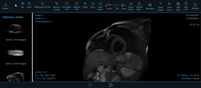

# Web-Based Myocardial Viability Assessment Platform via Deep Learning
**In collaboration with the NIH Bethesda Lab, USA**

A state-of-the-art web platform for **myocardial infarction segmentation** in **Cardiac Magnetic Resonance (CMR)** imaging. Powered by deep learning, this tool offers full AI-assisted analysis combined with a professional-grade DICOM viewer, enabling clinicians to view, edit, quantify, and report infarcted regions with precision.

## Overview

This platform offers an end-to-end workflow for myocardial viability analysis by combining:

* AI-based infarction segmentation
* Interactive manual editing tools
* Real-time DICOM image manipulation
* Multi-series viewing and comparison
* Metadata extraction and structured reporting

Built using **React**, **Cornerstone.js**, **Django**, and **PyDICOM**.

## 🌟 Key Features

### 🔹 AI & Segmentation

* **Automatic Infarction Segmentation**  
  A deep learning model automatically detects and highlights infarcted myocardial regions from uploaded DICOM studies.

* **Segmentation Overlays**  
  Visual overlays of predicted infarct masks allow clear differentiation from surrounding tissue.

* **Processed Image Comparison**  
  Toggle between raw, AI-segmented, and manually corrected views in side-by-side or overlaid formats.

* **Feedback Loop for Continuous Learning**  
  Corrections by clinicians can be re-integrated into the model pipeline for future improvements.

### 🖌️ Interactive Brush Tools

* **Pixel-Level Manual Fine-Tuning**  
  Clinicians can adjust AI segmentation masks using a brush tool with:
  * Variable brush size  
  * Eraser mode  
  * Precision placement  

* **Annotation Features**  
  * Draw, erase, and refine segmentations  
  * Clear points or entire masks  
  * Save and reload JSON-formatted annotations  

* **Real-Time Visual Feedback**  
  Immediate visual updates during brush interaction with synchronized overlays and series views.

### 🖼️ DICOM Viewer Capabilities

* **DICOM Upload & Thumbnail Navigation**  
  Load full DICOM studies with sidebar thumbnails for rapid series switching.
  

* **Multi-Viewer & Split Screen**  
  View multiple sequences side-by-side with synchronized scrolling and tool application.

* **Interactive Image Manipulation**  
  * Zoom, pan, rotate  
  * Brightness/contrast adjustment  
  * Instant image updates with hardware acceleration

* **Measurement Tools**  
  * Linear length and angle measurement  
  * Rectangle and elliptical ROI selection  
  * Coordinate and intensity readout per pixel

* **Overlay & Metadata Display**  
  * AI masks and manual edits layered over native DICOM slices  
  * Metadata such as TR, TE, acquisition time, and study identifiers shown

### 📊 Reporting & Quantification

* **Quantification Tools**  
  Enable infarction measurement and volumetric analysis directly from segmented masks.

* **Automated Reporting**  
  Generate downloadable reports (PDF/JSON) summarizing:  
  * Infarct size and location  
  * Measurement details  
  * DICOM metadata

---

## 🧰 Technology Stack

| Layer               | Technologies Used                        |
| ------------------- | ---------------------------------------- |
| **Frontend**        | React, Cornerstone.js, Cornerstone Tools |
| **Backend**         | Django, Django REST Framework            |
| **Medical Imaging** | PyDICOM, dcmjs                           |
| **Deep Learning**   | Custom model for infarct segmentation    |

---

## 📸 Screenshots

### 🔧 Platform Feature Overview  

### 🖼️ DICOM Viewer in Action  

---

## 🎥 Demo

📽️ *[Insert link to demo or deployment here]*

▶[Watch demo video](./demo.mp4)

---
